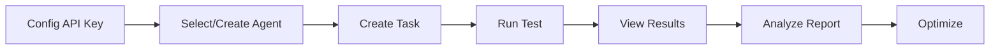
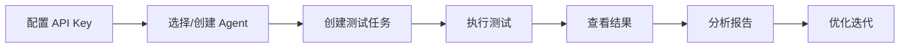

# Agent Lab 🤖

<div align="center">

**A Professional Platform for Testing and Evaluating LLM Agent Capabilities**

**专业的 LLM Agent 能力测试与评估平台**

[](https://opensource.org/licenses/MIT)
[](https://www.typescriptlang.org/)
[](https://nodejs.org/)
[](http://makeapullrequest.com)

[English](#english) | [中文](#chinese)

</div>

---

## `<a id="english"></a>`📖 English Documentation

### 🎯 What is Agent Lab?

Agent Lab is a professional platform for testing and evaluating LLM Agent capabilities. It allows you to:

- 🧪 **Systematic Testing** - Standardized evaluation of various Agent capabilities.
- 📊 **Quantitative Metrics** - Automatic calculation of Accuracy, F1, Latency, and other key metrics.
- 🔍 **Deep Analysis** - AI-generated issue analysis and optimization suggestions.
- 📈 **Comparison Tracking** - A/B testing and historical trend analysis.
- 🎯 **Scenario Evaluation** - Support for both atomic capabilities and multi-step combined scenarios.

### ✨ Key Features

#### 🔹 Three Core Agent Modules

1. **Intent Recognition**

   - Accurate user intent classification with confidence scores.
   - Support for custom intent lists and Few-shot examples.
   - Provides confusion matrix and confidence distribution analysis.
2. **Multi-turn Dialogue**

   - Intelligent context and history management.
   - Automatic tracking of dialogue state and slot filling.
   - Evaluation of coherence and task completion rate.
3. **Memory Management**

   - AI-powered extraction and storage of key information.
   - Intelligent retrieval based on importance weights.
   - Evaluation of recall accuracy and storage efficiency.

#### 🔹 Comprehensive Evaluation System

- ✅ **Automated Testing** - Batch execution of test cases with asynchronous processing.
- ✅ **Multi-dimensional Metrics** - Accuracy, Precision, Recall, F1, Latency, Token Usage.
- ✅ **AI Reports** - Automatic issue analysis, pattern discovery, and optimization tips.
- ✅ **Real-time Monitoring** - Track test progress and status in real-time.
- ✅ **Data Visualization** - Charts showing test results and trends.

#### 🔹 Scenario-based Testing

- 📝 **AtomicTask** - Test a single capability.
- 🔗 **ScenarioTask** - Test multi-step combined workflows.
- 🎬 **Built-in Scenarios** - Includes multiple typical scenario examples.
- 🔧 **Custom Scenarios** - Flexibly define data flow and step orchestration.

### 🚀 Quick Start

#### Prerequisites

```bash
Node.js >= 18.0.0
npm >= 9.0.0
```

#### 📦 Installation & Setup

**1. Clone the repository**

```bash
git clone https://github.com/yourusername/vibecoding-learn.git
cd vibecoding-learn/agent-lab
```

**2. Start Backend**

```bash
cd backend

# Install dependencies
npm install

# Configure environment variables
cp .env.example .env
# Edit .env and set ENCRYPTION_KEY (32 characters)

# Initialize database
npm run prisma:generate
npm run prisma:migrate
npm run prisma:seed    # Load example data

# Start backend server
npm run dev
# 🚀 Backend running at http://localhost:3001
```

**3. Start Frontend** (New Terminal)

```bash
cd frontend

# Install dependencies
npm install

# Start frontend server
npm run dev
# 🎨 Frontend running at http://localhost:3000
```

**4. Verify Installation**

```bash
# Test backend health check
curl http://localhost:3001/health
# Should return: {"status":"ok","timestamp":"..."}

# View built-in Agents
curl http://localhost:3001/api/agents
# Should return 3 built-in Agents
```

### 💡 User Guide

#### Workflow



#### 1️⃣ Configure LLM API Key

First-time setup requires configuring an LLM provider:

```bash
curl -X POST http://localhost:3001/api/settings/api-config \
  -H "Content-Type: application/json" \
  -d '{
    "name": "OpenAI GPT-4",
    "provider": "openai",
    "apiKey": "sk-your-api-key",
    "baseUrl": "https://api.openai.com/v1",
    "modelName": "gpt-4",
    "isDefault": true
  }'
```

Supported providers: `openai`, `anthropic`, `custom`.

#### 2️⃣ Create Test Task

**Example: Intent Recognition Task**

```bash
curl -X POST http://localhost:3001/api/tasks \
  -H "Content-Type: application/json" \
  -d '{
    "name": "Customer Service Intent Test",
    "type": "intent",
    "testCases": [
      {
        "input": "I want a refund",
        "expected": {
          "intent": "refund",
          "confidence": 0.9
        }
      }
    ]
  }'
```

#### 3️⃣ Run Test & View Results

```bash
# Run Test
curl -X POST http://localhost:3001/api/test-runs \
  -H "Content-Type: application/json" \
  -d '{
    "agentId": "agent-id",
    "taskId": "task-id",
    "apiConfigId": "config-id"
  }'

# Get Report
curl http://localhost:3001/api/test-runs/{runId}/report
```

### 🎬 Example Scenarios

The project includes multiple pre-configured scenario examples (located in `backend/examples/scenarios/`):

1. **Basic Conversation** - Intent recognition + response generation.
2. **Data Flow** - Demonstrates data passing between steps.
3. **Error Handling** - Testing exception scenario handling.
4. **Multi-turn Conversation** - Complex context management.
5. **Content Analysis** - Comprehensive capability evaluation.

### 📁 Project Structure

```
├── agent-lab/                           # 🏠 Agent Lab Main Project
│   ├── backend/                         # 🔧 Backend Service
│   │   ├── src/
│   │   │   ├── api/                     # REST API Routes
│   │   │   │   ├── agents/             # Agent Management CRUD
│   │   │   │   ├── tasks/              # Task Management
│   │   │   │   ├── datasets/           # Dataset Management
│   │   │   │   ├── test-runs/          # Test Execution & Results
│   │   │   │   └── settings/           # API Key Config
│   │   │   ├── lib/
│   │   │   │   ├── llm/                # LLM Client Wrapper
│   │   │   │   ├── agents/
│   │   │   │   │   ├── intent.ts       # Intent Recognition Module
│   │   │   │   │   ├── dialogue.ts     # Multi-turn Dialogue Module
│   │   │   │   │   └── memory.ts       # Memory Management Module
│   │   │   │   ├── evaluator/          # Evaluation System
│   │   │   │   │   ├── intent-metrics.ts
│   │   │   │   │   ├── dialogue-metrics.ts
│   │   │   │   │   ├── memory-metrics.ts
│   │   │   │   │   └── report.ts       # AI Report Generation
│   │   │   │   ├── prisma.ts           # Database Client
│   │   │   │   └── utils/
│   │   │   ├── types/                  # TypeScript Definitions
│   │   │   └── index.ts                # Express Entry
│   │   ├── examples/
│   │   │   └── scenarios/              # 📝 Example Scenarios
│   │   ├── prisma/
│   │   │   ├── schema.prisma           # Database Schema
│   │   │   └── seed.ts                 # Seed Data
│   │   ├── docs/                       # 📚 Documentation
│   │   │   ├── api/API.md             # Full API Docs
│   │   │   ├── FRONTEND_GUIDE.md       # Frontend Integration Guide
│   │   │   └── QUICK_REFERENCE.md      # Quick Reference
│   │   ├── tests/                      # Unit Tests
│   │   ├── package.json
│   │   ├── tsconfig.json
│   │   └── README.md
│   │
│   ├── frontend/                        # 🎨 Frontend Application
│   │   ├── src/
│   │   │   ├── app/                    # Next.js App Router
│   │   │   ├── components/
│   │   │   │   ├── TaskRunner.tsx      # Task Execution Component
│   │   │   │   ├── TestResults.tsx     # Test Results Display
│   │   │   │   ├── TraceViewer.tsx     # Trace Viewer
│   │   │   │   └── layout/
│   │   │   ├── hooks/                  # React Hooks
│   │   │   ├── lib/                    # Utils
│   │   │   └── types/                  # Types
│   │   ├── public/
│   │   ├── package.json
│   │   └── README.md
│   │
│   └── BACKEND_COMPLETED.md            # Backend Completion Note
│
├── docs/                                # 📖 Project Docs
│   ├── architecture/                   # Architecture Design
│   ├── plans/                          # Plans
│   └── analysis/                       # Analysis
│
├── llm.txt                             # 🤖 LLM Context
└── README.md                           # 📄 This File
```

### 📊 Evaluation Metrics

#### Intent Recognition

- **Accuracy** - Overall classification accuracy (0-1).
- **Precision & Recall** - Per-intent performance metrics.
- **F1 Score** - Harmonic mean of precision and recall.
- **Confidence** - Average prediction confidence.
- **Latency** - Response time per request (ms).

#### Multi-turn Dialogue

- **Coherence Score** - Conversation flow quality (0-1).
- **Context Retention** - Information preservation (0-1).
- **Task Completion Rate** - Goal achievement rate (0-1).
- **Average Turns** - Average turns to complete a task.
- **Latency per Turn** - Average response time per turn (ms).

#### Memory Management

- **Recall Accuracy** - Information retrieval correctness (0-1).
- **Storage Efficiency** - Relevant vs irrelevant data ratio (0-1).
- **Retrieval Relevance** - Search result quality (0-1).
- **Memory Size** - Number of stored information items.
- **Retrieval Time** - Average search time (ms).

### 🛠️ Tech Stack

**Backend:**

- Node.js 18+ & Express.js
- TypeScript (Strict Mode)
- Prisma ORM + SQLite
- Vitest (Testing)
- Zod (Validation)
- AES-256-CBC Encryption

**Frontend:**

- Next.js 14 (App Router)
- React 18 & TypeScript
- TailwindCSS + shadcn/ui
- Recharts for Visualization

**AI/ML:**

- OpenAI API Compatible
- Support for multiple LLM Providers (OpenAI, Anthropic, Custom)
- Function Calling Support

### 📚 Documentation Resources

- **[Backend API Documentation](./agent-lab/backend/docs/api/API.md)** - Full API reference.
- **[Frontend Integration Guide](./agent-lab/backend/docs/FRONTEND_GUIDE.md)** - React/Next.js integration examples.
- **[Quick Reference](./agent-lab/backend/docs/QUICK_REFERENCE.md)** - Common operations lookup.
- **[Backend README](./agent-lab/backend/README.md)** - Detailed backend documentation.
- **[LLM Context](./llm.txt)** - Project architecture and collaboration guidelines.

### 🗓️ Roadmap

#### ✅ Phase 1: Core Platform (Completed)

- [X] Backend API & 3 Agent Types.
- [X] SQLite Database + Prisma ORM.
- [X] Automated Testing & Evaluation System.
- [X] AI-Powered Report Generation.
- [X] API Key Encryption.
- [X] Unit Tests (80%+ Coverage).
- [X] 5 Example Scenarios.

#### 🚧 Phase 2: Frontend & UX (In Progress - Q1 2026)

- [ ] Dashboard with Key Metrics.
- [ ] Agent Management Interface.
- [ ] Task Creation & Editing UI.
- [ ] Real-time Test Progress Visualization.
- [ ] Interactive Result Charts (Recharts).
- [ ] Settings & API Configuration Page.

#### 🔮 Phase 3: Advanced Features (Q2-Q3 2026)

- [ ] Custom Agent Type Support.
- [ ] Batch Testing with Datasets.
- [ ] Agent A/B Testing.
- [ ] Export Results (CSV, JSON, PDF).
- [ ] Historical Trend Analysis.
- [ ] Multi-user Support & Permissions.
- [ ] PostgreSQL Migration for Production.
- [ ] Docker Containerization.

#### 🌟 Phase 4: Enterprise & Ecosystem (Q4 2026)

- [ ] Plugin System for Custom Evaluators.
- [ ] LangChain/LangGraph Integration.
- [ ] Cloud Deployment (AWS/Azure/GCP).
- [ ] Real-time Collaboration.
- [ ] Advanced Analytics & ML Insights.
- [ ] Enterprise SSO & RBAC.
- [ ] API Rate Limiting & Quotas.
- [ ] Webhook Notifications.

### 🤝 Contributing

We welcome contributions! Please follow these steps:

1. Fork the Project.
2. Create your Feature Branch (`git checkout -b feature/AmazingFeature`).
3. Commit your Changes (`git commit -m 'feat: Add some AmazingFeature'`).
4. Push to the Branch (`git push origin feature/AmazingFeature`).
5. Open a Pull Request.

### 📄 License

Distributed under the MIT License. See `LICENSE` for more information.

### 🙏 Acknowledgments

- Built with [Next.js](https://nextjs.org/)
- Powered by [OpenAI API](https://openai.com/)
- UI components from [shadcn/ui](https://ui.shadcn.com/)

---

## `<a id="chinese"></a>`📖 中文文档

### 🎯 什么是 Agent Lab？

Agent Lab 是一个专业的 LLM Agent 能力测试与评估平台，让你能够：

- 🧪 **系统化测试** - 对 Agent 的各项能力进行标准化评测。
- 📊 **量化评估** - 自动计算准确率、F1、延迟等关键指标。
- 🔍 **深度分析** - AI 生成问题分析和优化建议。
- 📈 **对比追踪** - A/B 测试和历史趋势分析。
- 🎯 **场景化评测** - 支持原子能力和多步组合场景。

### ✨ 核心功能

#### 🔹 三大 Agent 能力模块

1. **意图识别 (Intent Recognition)**

   - 准确识别用户意图并给出置信度。
   - 支持自定义意图列表和 Few-shot 示例。
   - 提供混淆矩阵和置信度分布分析。
2. **多轮对话 (Multi-turn Dialogue)**

   - 智能管理对话上下文和历史。
   - 自动追踪对话状态和槽位信息。
   - 评估连贯性和任务完成率。
3. **记忆管理 (Memory Management)**

   - AI 自动提取和存储关键信息。
   - 基于重要性权重的智能检索。
   - 评估召回准确率和存储效率。

#### 🔹 完善的评测系统

- ✅ **自动化测试** - 批量执行测试用例，异步处理。
- ✅ **多维度指标** - 准确率、精确率、召回率、F1、延迟、Token 使用量。
- ✅ **AI 生成报告** - 自动分析问题、发现模式、提供优化建议。
- ✅ **实时监控** - 测试进度和状态实时追踪。
- ✅ **数据可视化** - 图表展示测试结果和趋势。

#### 🔹 场景化测试

- 📝 **原子任务 (AtomicTask)** - 测试单一能力。
- 🔗 **场景任务 (ScenarioTask)** - 测试多步骤组合流程。
- 🎬 **预置场景** - 内置多个典型场景示例。
- 🔧 **自定义场景** - 灵活定义数据流转和步骤编排。

### 🚀 快速开始

#### 环境要求

```bash
Node.js >= 18.0.0
npm >= 9.0.0
```

#### 📦 安装与启动

**1. 克隆项目**

```bash
git clone https://github.com/yourusername/vibecoding-learn.git
cd vibecoding-learn/agent-lab
```

**2. 启动后端**

```bash
cd backend

# 安装依赖
npm install

# 配置环境变量
cp .env.example .env
# 编辑 .env，设置 ENCRYPTION_KEY（32位字符）

# 初始化数据库
npm run prisma:generate
npm run prisma:migrate
npm run prisma:seed    # 加载示例数据

# 启动后端服务
npm run dev
# 🚀 后端运行在 http://localhost:3001
```

**3. 启动前端**（新终端）

```bash
cd frontend

# 安装依赖
npm install

# 启动前端服务
npm run dev
# 🎨 前端运行在 http://localhost:3000
```

**4. 验证安装**

```bash
# 测试后端健康检查
curl http://localhost:3001/health
# 应返回: {"status":"ok","timestamp":"..."}

# 查看内置 Agent
curl http://localhost:3001/api/agents
# 应返回 3 个内置 Agent
```

### 💡 使用指南

#### 完整工作流程



#### 1️⃣ 配置 LLM API Key

首次使用需要配置 LLM 提供商：

```bash
# 通过 API 配置
curl -X POST http://localhost:3001/api/settings/api-config \
  -H "Content-Type: application/json" \
  -d '{
    "name": "OpenAI GPT-4",
    "provider": "openai",
    "apiKey": "sk-your-api-key",
    "baseUrl": "https://api.openai.com/v1",
    "modelName": "gpt-4",
    "isDefault": true
  }'
```

支持的提供商：

- `openai` - OpenAI API
- `anthropic` - Claude API
- `custom` - 自定义兼容 OpenAI 格式的 API

#### 2️⃣ 查看和使用预置 Agent

系统内置三个 Agent 模板：

```bash
# 查看所有 Agent
curl http://localhost:3001/api/agents

# 查看特定类型
curl http://localhost:3001/api/agents?type=intent
```

#### 3️⃣ 创建测试任务

**示例：意图识别任务**

```bash
curl -X POST http://localhost:3001/api/tasks \
  -H "Content-Type: application/json" \
  -d '{
    "name": "客服意图识别测试",
    "description": "测试客服场景下的意图识别能力",
    "type": "intent",
    "testCases": [
      {
        "input": "我要退款",
        "expected": {
          "intent": "refund",
          "confidence": 0.9
        }
      },
      {
        "input": "订单在哪里",
        "expected": {
          "intent": "order_status",
          "confidence": 0.85
        }
      }
    ]
  }'
```

#### 4️⃣ 执行测试

```bash
curl -X POST http://localhost:3001/api/test-runs \
  -H "Content-Type: application/json" \
  -d '{
    "agentId": "agent-id-here",
    "taskId": "task-id-here",
    "apiConfigId": "config-id-here"
  }'

# 返回测试 ID，用于后续查询
# {"data": {"id": "run-123", "status": "running"}}
```

#### 5️⃣ 查看测试结果

```bash
# 查询测试状态
curl http://localhost:3001/api/test-runs/run-123

# 获取评测报告
curl http://localhost:3001/api/test-runs/run-123/report
```

### 🎬 示例场景

项目包含多个预置场景示例（位于 `backend/examples/scenarios/`）：

1. **基础对话** - 意图识别 + 响应生成。
2. **数据流转** - 演示步骤间数据传递。
3. **错误处理** - 测试异常场景处理。
4. **多轮对话** - 复杂上下文管理。
5. **内容分析** - 综合能力评测。

### 📁 项目结构

```
vibecoding-learn/
├── agent-lab/                           # 🏠 Agent Lab 主项目
│   ├── backend/                         # 🔧 后端服务
│   │   ├── src/
│   │   │   ├── api/                     # REST API 路由
│   │   │   │   ├── agents/             # Agent 管理 CRUD
│   │   │   │   ├── tasks/              # 任务管理
│   │   │   │   ├── datasets/           # 数据集管理
│   │   │   │   ├── test-runs/          # 测试执行与结果
│   │   │   │   └── settings/           # API Key 配置
│   │   │   ├── lib/
│   │   │   │   ├── llm/                # LLM 客户端封装
│   │   │   │   ├── agents/
│   │   │   │   │   ├── intent.ts       # 意图识别模块
│   │   │   │   │   ├── dialogue.ts     # 多轮对话模块
│   │   │   │   │   └── memory.ts       # 记忆管理模块
│   │   │   │   ├── evaluator/          # 评测系统
│   │   │   │   │   ├── intent-metrics.ts
│   │   │   │   │   ├── dialogue-metrics.ts
│   │   │   │   │   ├── memory-metrics.ts
│   │   │   │   │   └── report.ts       # AI 报告生成
│   │   │   │   ├── prisma.ts           # 数据库客户端
│   │   │   │   └── utils/
│   │   │   ├── types/                  # TypeScript 类型定义
│   │   │   └── index.ts                # Express 入口
│   │   ├── examples/
│   │   │   └── scenarios/              # 📝 示例场景
│   │   ├── prisma/
│   │   │   ├── schema.prisma           # 数据库 Schema
│   │   │   └── seed.ts                 # 示例数据
│   │   ├── docs/                       # 📚 文档
│   │   │   ├── api/API.md             # API 完整文档
│   │   │   ├── FRONTEND_GUIDE.md       # 前端对接指南
│   │   │   └── QUICK_REFERENCE.md      # 快速参考
│   │   ├── tests/                      # 单元测试
│   │   ├── package.json
│   │   ├── tsconfig.json
│   │   └── README.md
│   │
│   ├── frontend/                        # 🎨 前端应用
│   │   ├── src/
│   │   │   ├── app/                    # Next.js App Router
│   │   │   ├── components/
│   │   │   │   ├── TaskRunner.tsx      # 任务执行组件
│   │   │   │   ├── TestResults.tsx     # 测试结果展示
│   │   │   │   ├── TraceViewer.tsx     # Trace 查看器
│   │   │   │   └── layout/
│   │   │   ├── hooks/                  # React Hooks
│   │   │   ├── lib/                    # 工具函数
│   │   │   └── types/                  # 类型定义
│   │   ├── public/
│   │   ├── package.json
│   │   └── README.md
│   │
│   └── BACKEND_COMPLETED.md            # 后端开发完成说明
│
├── docs/                                # 📖 项目文档
│   ├── architecture/                   # 架构设计
│   ├── plans/                          # 规划文档
│   └── analysis/                       # 分析文档
│
├── llm.txt                             # 🤖 LLM 上下文说明
└── README.md                           # 📄 本文件
```

### 📊 评测指标

系统为三种 Agent 类型提供不同的评测指标：

#### 意图识别 (Intent Recognition)

- **准确率 (Accuracy)** - 整体分类准确性 (0-1)。
- **精确率 & 召回率** - 每个意图的性能指标。
- **F1 分数** - 精确率和召回率的调和平均值。
- **置信度** - 平均预测置信度。
- **延迟** - 单次请求响应时间（毫秒）。

#### 多轮对话 (Multi-turn Dialogue)

- **连贯性评分** - 对话流畅度 (0-1)。
- **上下文保留率** - 信息保持能力 (0-1)。
- **任务完成率** - 目标达成率 (0-1)。
- **平均轮次** - 完成任务的平均对话轮数。
- **单轮延迟** - 每轮对话的平均响应时间。

#### 记忆管理 (Memory Management)

- **召回准确率** - 信息检索正确性 (0-1)。
- **存储效率** - 相关信息占比 (0-1)。
- **检索相关性** - 搜索结果质量 (0-1)。
- **记忆大小** - 存储的信息条数。
- **检索时间** - 平均检索耗时（毫秒）。

### 🛠️ 技术栈

**后端:**

- **运行时**: Node.js 18+
- **框架**: Express.js
- **语言**: TypeScript (严格模式)
- **数据库**: Prisma ORM + SQLite
- **测试**: Vitest (80%+ 覆盖率)
- **验证**: Zod Schema Validation
- **安全**: AES-256-CBC 加密

**前端:**

- **框架**: Next.js 14 (App Router)
- **UI 库**: React 18 + TypeScript
- **样式**: TailwindCSS + shadcn/ui
- **图表**: Recharts
- **状态**: React Server Components

**AI/ML:**

- OpenAI API 兼容格式
- 支持多种 LLM 提供商 (OpenAI, Anthropic, 自定义)
- Function Calling 支持

### 📚 文档资源

- **[后端 API 文档](./agent-lab/backend/docs/api/API.md)** - 完整的 REST API 接口说明。
- **[前端集成指南](./agent-lab/backend/docs/FRONTEND_GUIDE.md)** - React/Next.js 对接示例。
- **[快速参考](./agent-lab/backend/docs/QUICK_REFERENCE.md)** - 常用操作速查。
- **[后端 README](./agent-lab/backend/README.md)** - 后端详细说明。
- **[LLM 上下文](./llm.txt)** - 项目架构与协作规范。

### 🗓️ 开发路线图

#### ✅ 第一阶段：核心平台（已完成）

- [X] 后端 API 及 3 种 Agent 类型。
- [X] SQLite 数据库 + Prisma ORM。
- [X] 自动化测试与评估系统。
- [X] AI 驱动的报告生成。
- [X] API Key 加密存储。
- [X] 单元测试（80%+ 覆盖率）。
- [X] 5 个示例场景。

#### 🚧 第二阶段：前端与用户体验（进行中 - 2026 Q1）

- [ ] 数据概览仪表盘。
- [ ] Agent 管理界面。
- [ ] 任务创建与编辑 UI。
- [ ] 测试进度实时可视化。
- [ ] 交互式结果图表 (Recharts)。
- [ ] 设置和 API 配置页面。

#### 🔮 第三阶段：高级功能（2026 Q2-Q3）

- [ ] 自定义 Agent 类型支持。
- [ ] 数据集批量测试。
- [ ] Agent A/B 对比测试。
- [ ] 结果导出 (CSV, JSON, PDF)。
- [ ] 历史趋势分析。
- [ ] 多用户支持与权限管理。
- [ ] PostgreSQL 生产环境迁移。
- [ ] Docker 容器化部署。

#### 🌟 第四阶段：企业级与生态（2026 Q4）

- [ ] 插件系统支持自定义评估器。
- [ ] 集成 LangChain/LangGraph。
- [ ] 云端部署 (AWS/Azure/GCP)。
- [ ] 实时协作功能。
- [ ] 高级分析与 ML 洞察。
- [ ] 企业 SSO 和基于角色的访问控制。
- [ ] API 速率限制与配额管理。
- [ ] Webhook 通知系统。

### 🤝 参与贡献

欢迎贡献代码！请遵循以下步骤：

1. Fork 本仓库。
2. 创建特性分支 (`git checkout -b feature/AmazingFeature`)。
3. 提交更改 (`git commit -m 'feat: 添加某个功能'`)。
4. 推送到分支 (`git push origin feature/AmazingFeature`)。
5. 发起 Pull Request。

### 📄 开源许可

本项目采用 MIT 许可证 - 详见 [LICENSE](LICENSE) 文件。

### 🙏 致谢

- 基于 [Next.js](https://nextjs.org/) 构建
- 由 [OpenAI API](https://openai.com/) 驱动
- UI 组件来自 [shadcn/ui](https://ui.shadcn.com/)

---

<div align="center">

**Made with ❤️ by Haimbeau1o**

⭐ Star this repo if you find it helpful!

</div>
